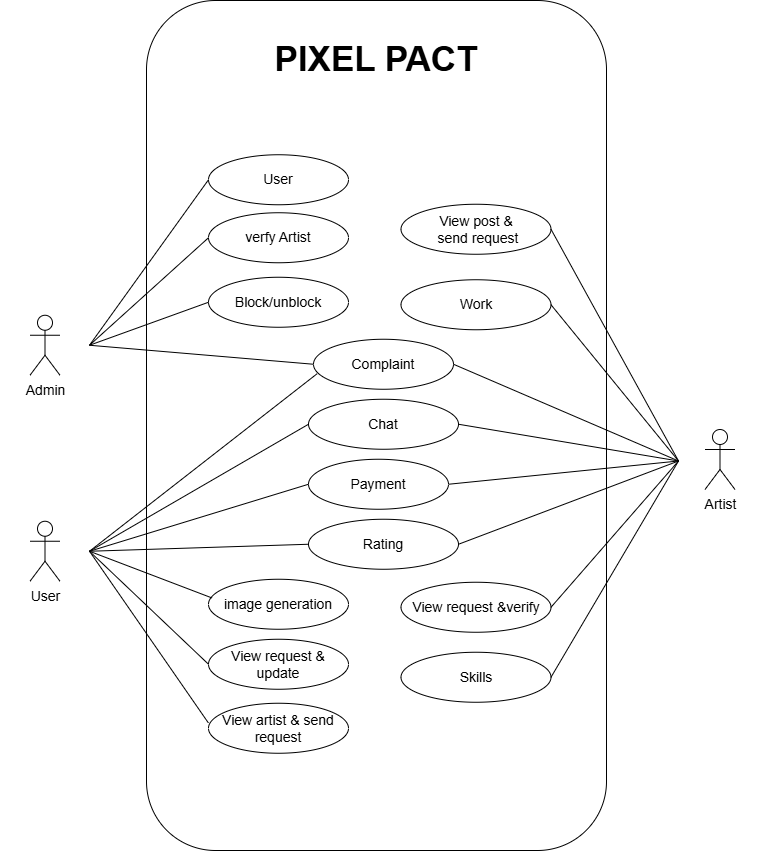
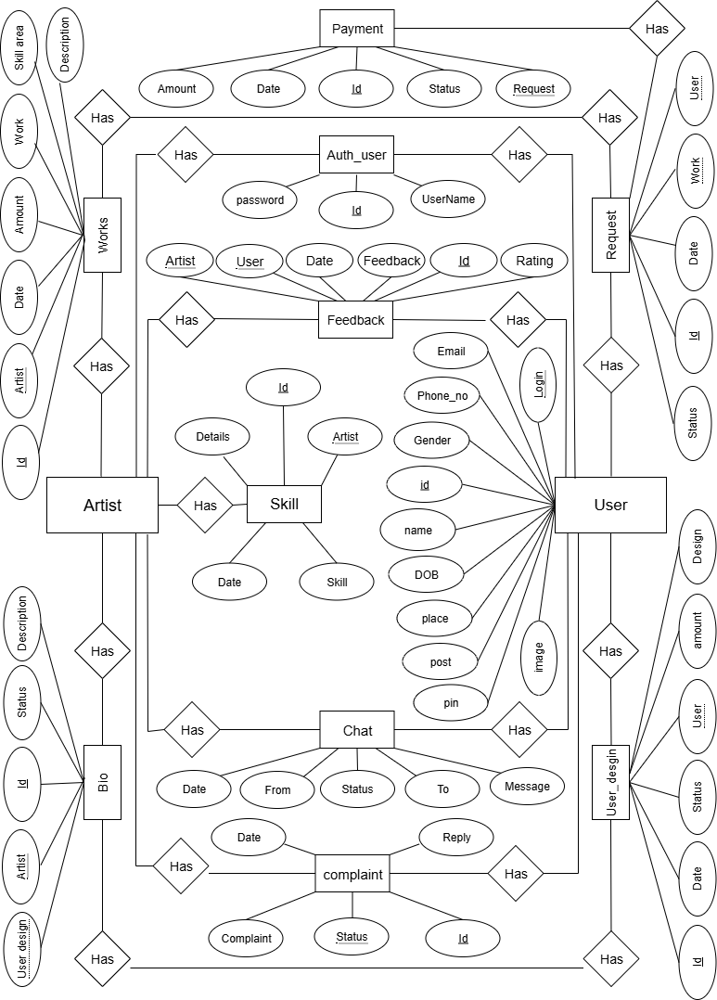
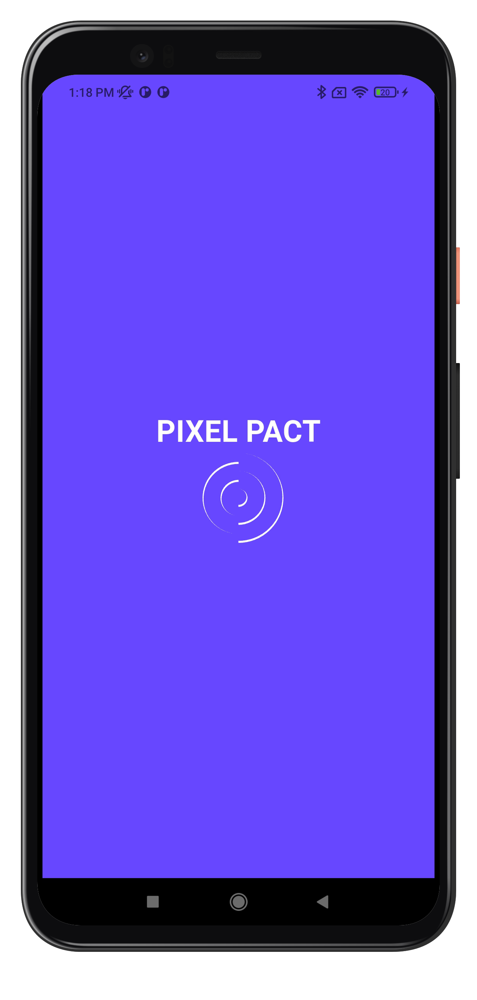
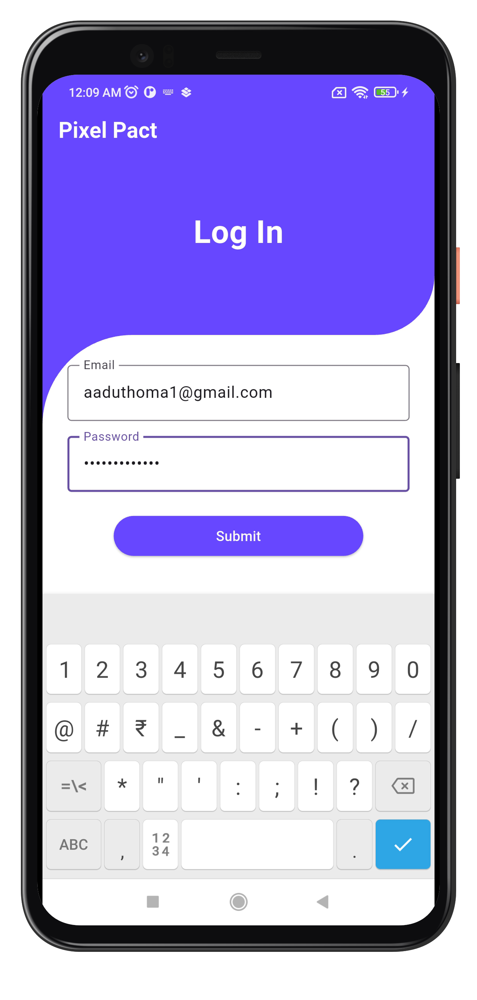
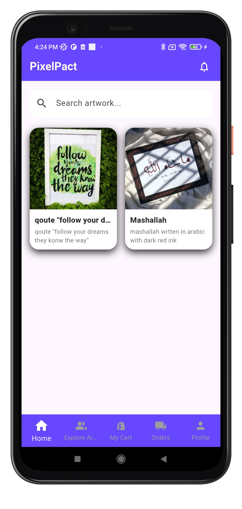
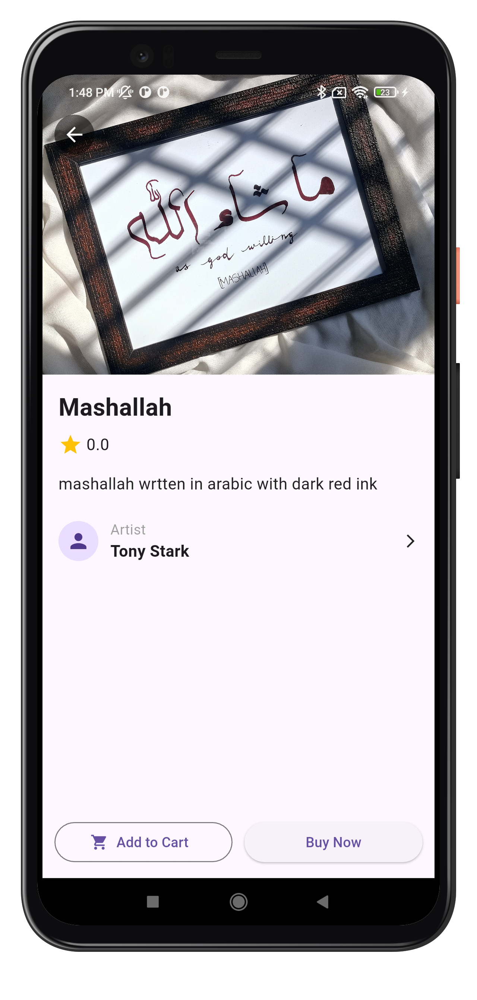
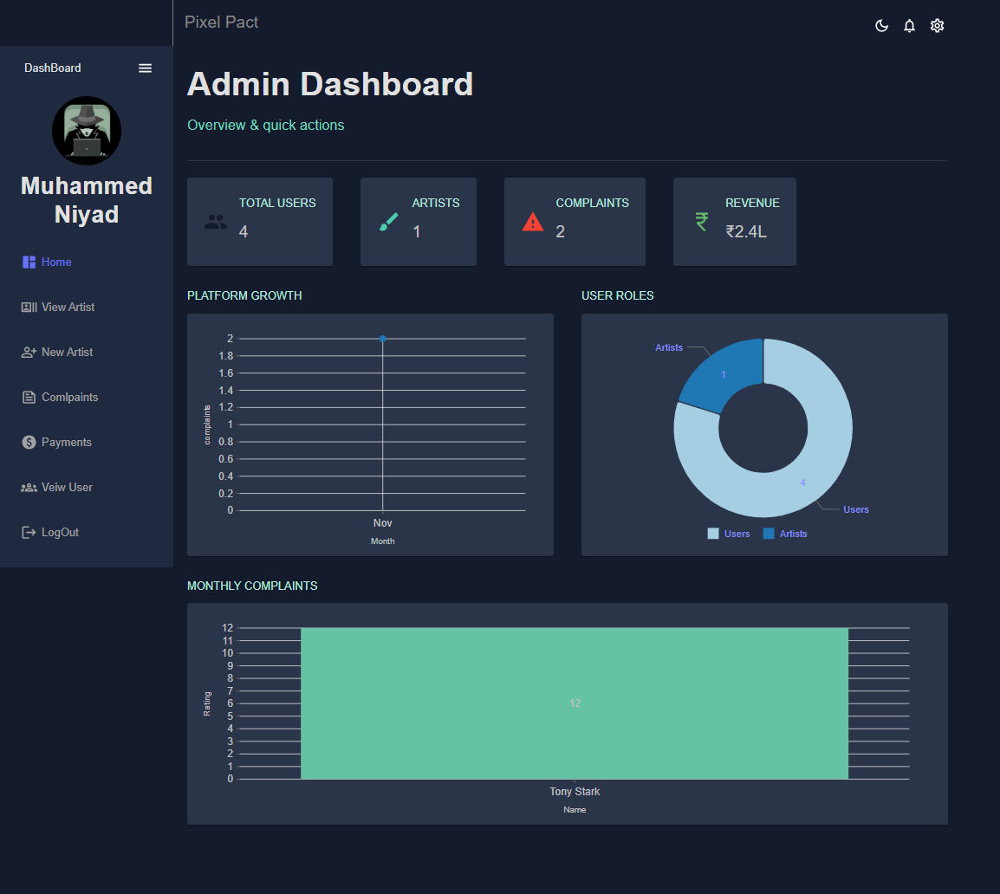
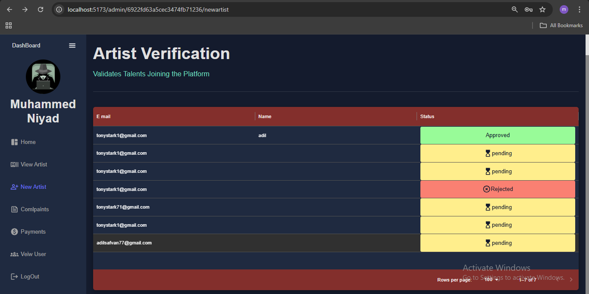
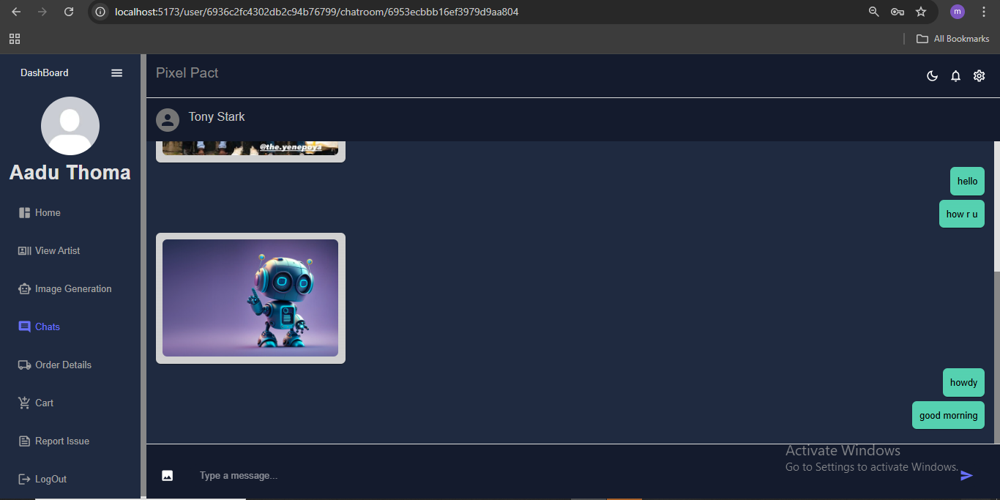
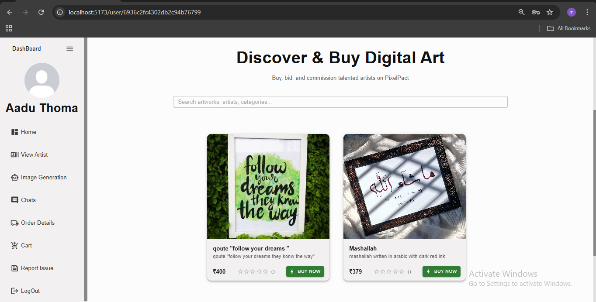

# PIXEL PACT:AI-POWERED DIGITAL ART WITH BLOCKCHAIN OWNERSHIP

In the expanding field of digital art, there is a growing need for a platform that
enables seamless, personalized collaboration between users and artists while ensuring
strong protection against image duplication and unauthorized copying. PixelPact is a
digital art creation and customization system that allows users to generate artwork
using AI-driven image generation or upload their own concepts for refinement. Users
can provide prompts, stylistic preferences, and visual references, enabling the
integrated AI engine to produce initial art concepts quickly and efficiently.
Alongside AI-generated outputs, users can request professional artists on the
platform to refine, enhance, or fully recreate artwork according to user requirements.
To safeguard originality, PixelPact integrates blockchain-based digital ownership
recording. Each finalized artwork is registered on the blockchain, creating an
immutable proof of authorship and ensuring images cannot be duplicated, altered, or
falsely claimed without detection. This protects both users and artists from
plagiarism, unauthorized reproduction, and intellectual property disputes.
By combining AI automation, creative customization, artist expertise, and
decentralized ownership protection, PixelPact delivers a next-generation platform for
secure, personalized, and trustworthy digital art creation.

## Teck Stack

- Frontend : React js,html5,css,javaScript
- Backend : Node js, express js ,python(FastAPI)
- Database : Mongodb
- AI : python(torch)
- Mobile : Flutter(dart)

## Project Documentation

[View Full Report](Documentation/PIXEL%20PACT%20.pdf)

## USE CASE DIAGRAM

 

## ER-DIAGRAM

 

## ACTIVITY DIAGRAM

 

## Mobile snapshots

## Web Screenshots

 
 
 
 
 

### Muhammed Niyad

Full-Stack Developer 
If you like this project, give it a ⭐
